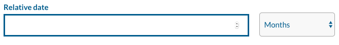

# React relative date input

Completely customizable input and select for choosing an relative date in the future.

## Example


## Installation

```bash
yarn add react-relative-date-input
```

## Usage
```js
import RelativeDatePicker from "react-relative-date-input";

const onChange = (momentDate) => {
    // gives you a moment.js date
    console.log(momentDate);
}

const YourForm = () => {
    return (
        <RelativeDatePicker
            onChange={onChange}
        />
    )
}

```

## Props

|Prop name|Description|Example values|
|----|----|----|
|onChange|Function that is called if the number or period type is changed|(momentDate) => {console.log(momentDate)};|
|numberInputClassName|CSS classes for number input field|"form-control"|
|numberInputStyle|Object with styles for number input field|{ fontSize: "14px" }|
|wrapperClassName|CSS Classes for number input field|"col-md-12"|
|wrapperStyle|Object with styles for wrapper|{ padding: "5px" }|
|labelClassName|CSS classes for label|"label-class"|
|labelStyle|Object with styles for label|{ fontSize: "14px" }|
|selectClassName|CSS classes period type select field|"form-control"|
|selectStyle|Object with styles for period type select field|{ fontSize: "14px" }|
|labelText|Text for label|"Relative date"|
|monthsLabel|Text for months in select|"Months"|
|daysLabel|Text for days in select|"Days"|
|weeksLabel|Text for weeks in select|"Weeks"|
|yearsLabel|Text for years in select|"Years"|

## Build
```bash
browserify index.js -o build/index.js
```

